# Water Effect
Now that you have learnt the basics of CapCut, let's see how you can create your own special effects!

<iframe width="720" height="405"
src="https://youtu.be/4TjUayYWgG8?si=py27z8X_Vgi_pJkD&t=12">
</iframe>

# Table Of Contents
- [CapCut](#capcut)
- [Table Of Contents](#table-of-contents)
  - [Download and Install](#download-and-install)
  - [Create New Project](#create-new-project)
  - [Import Photos And Videos](#import-photos-and-videos)
  - [Edit Video](#edit-video)
    - [Play/Pause Video](#playpause-video)
    - [Arranging Clips](#arranging-clips)
    - [Add Music](#add-music)
    - [Add Text](#add-text)
  - [Save and Export](#save-and-export)

--------------------------------------------------------------------------------------------------------------------

## Record 2 videos

1. First video: Film your phone over the cup
<iframe width="720" height="405"
src="https://drive.google.com/file/d/16mL8aNxOZC9NYLpjkMnLG5ZbPJdeDwjN/view?resourcekey">
</iframe>
3. Second video: Film yourself pouring water into the cup

1. go to the apple app store
2. search for CapCut
3. Download and install the app!
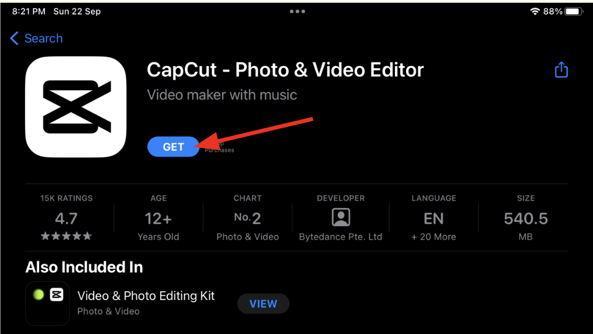

---

## Create New Project
1. Open CapCut
2. Click “+ New Project”

3. Click on allow access to all photos
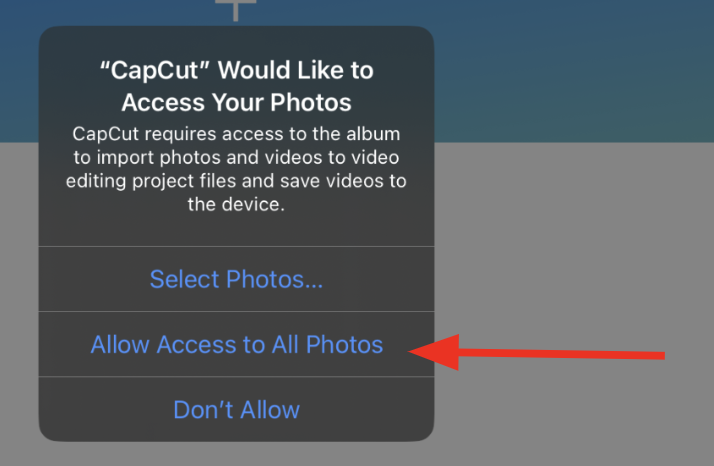

## Import Photos And Videos
1. Select photos and videos
2. Click on "Add"
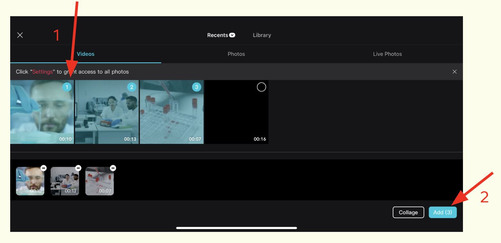

## Edit Video
CapCut has many editing tools !
Most frequently used tools are
- Play and pause
- Arranging clips
- Audio (Sound / Music)
- Text (Words)
- and many more !

💡 **Tip:** Avoid using **Pro effects!** You won't be able to save your video

  ### Play/Pause Video
  Press the **play** button to play/pause your video
  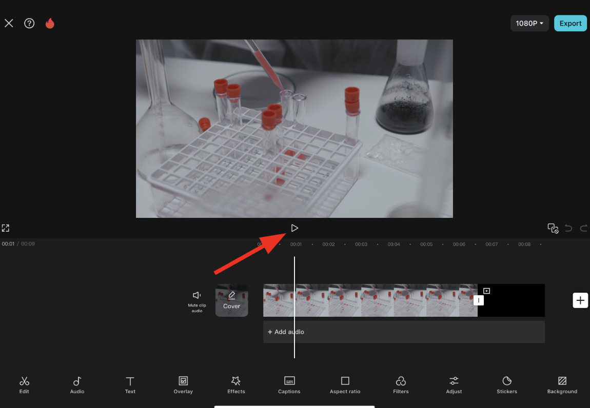
  ### Arranging Clips
  1. Hold your clip
  2. Drag it to the desired position
  3. Release
  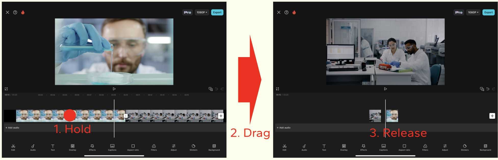

  ### Add Music
  1. Choose the Audio Button
  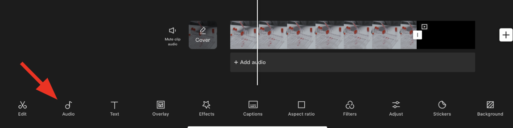
  2. Click on sounds
  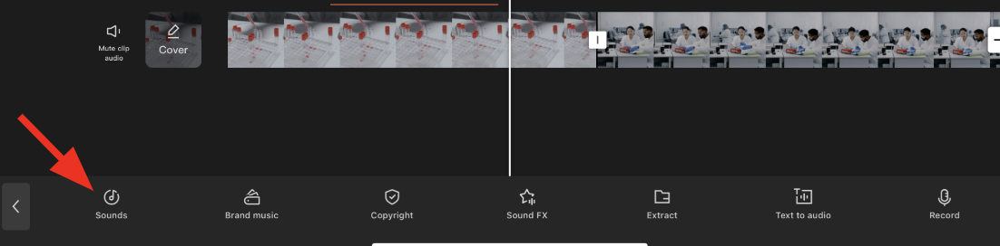
  3. Choose your favourite song
  4. Click on the + icon
  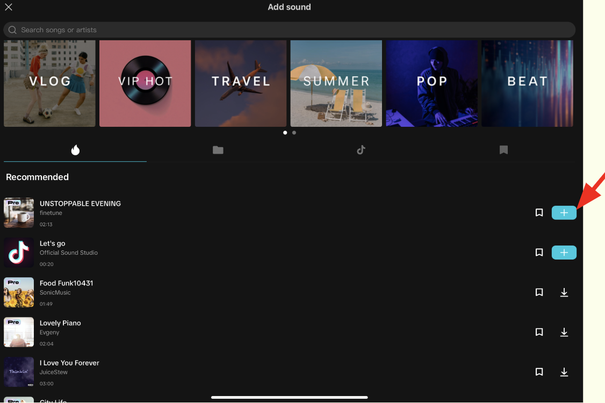
  ### Add Text
  1. Choose the Text Icon
  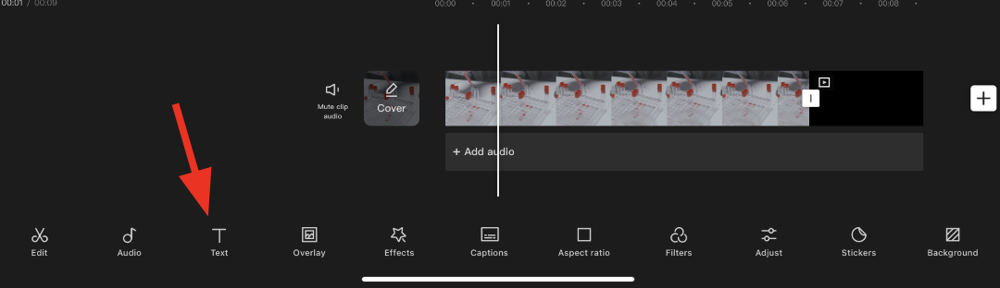
  2. Click the Add Text button
  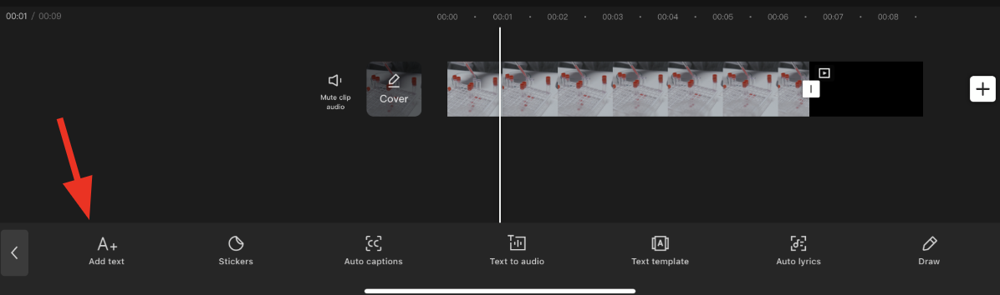
  3. Type words
  4. Choose your favourite style!
  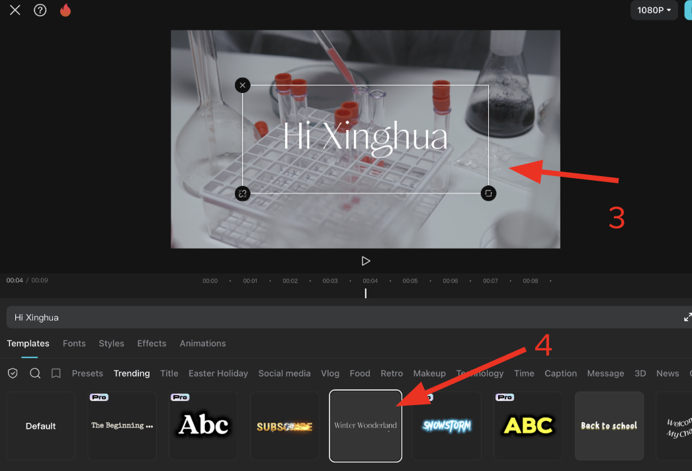
## Save and Export
1. Click on the export button
  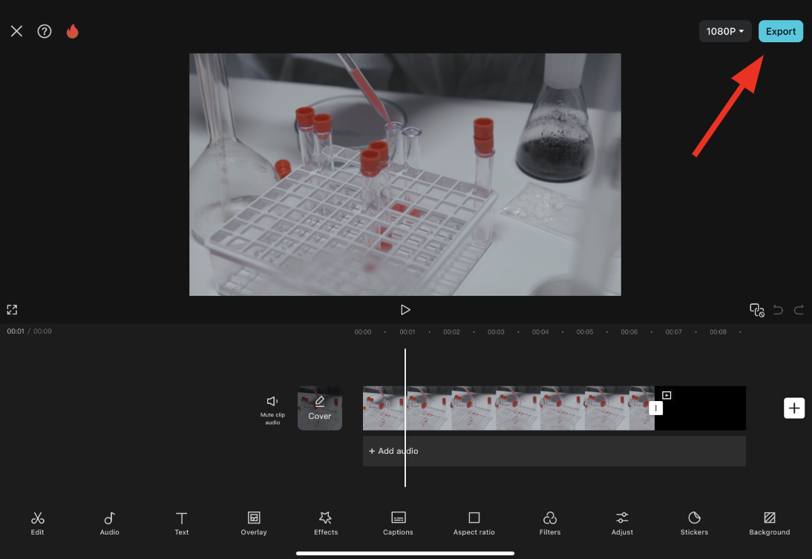
2. Wait for 100% to appear. 
3. Go to the photos app to view your video!
   

[↑ Back to top](#table-of-contents)
