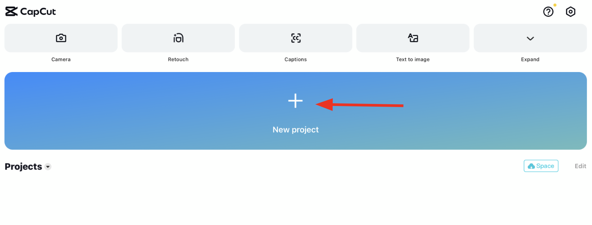

Now that you have learnt the basics of CapCut, let's see how you can create your own special effects!

<iframe width="560" height="315" src="https://www.youtube.com/embed/4TjUayYWgG8?si=py27z8X_Vgi_pJkD&amp;start=12" title="YouTube video player" frameborder="0" allow="accelerometer;  clipboard-write; encrypted-media; gyroscope; picture-in-picture; web-share" referrerpolicy="strict-origin-when-cross-origin" allowfullscreen></iframe>

# Table Of Contents
- [Record 2 videos](#record-2-videos)
- [Import first video](#import-first-video)
- [Add overlay](#add-overlay)
- [Adjust both videos](#adjust-both-videos)
- [Apply masking (cover)](#apply-masking-(cover))

--------------------------------------------------------------------------------------------------------------------

## Record 2 videos

1.First video: Film your phone over the cup

<iframe width="315" height="560" 
src="https://www.youtube.com/embed/NfLe4gsJVQA?si=0nrCpwz8wbEFFzvQ" 
title="YouTube video player" frameborder="0" 
allow="accelerometer; autoplay; clipboard-write; encrypted-media;
gyroscope; picture-in-picture;
web-share"
allowfullscreen></iframe>

2.Second video: Film yourself pouring water into the cup
<iframe width="315" height="560" 
src="https://www.youtube.com/embed/m-gmXVgz2Bw" 
title="YouTube video player" frameborder="0" 
allow="accelerometer; autoplay; clipboard-write; encrypted-media;
gyroscope; picture-in-picture;
web-share"
allowfullscreen></iframe>

---

## Import first video
1.Open CapCut
2.Click “+ New Project”
   

3.Select your first video
4.Click on "Add"
   

## Add overlay
1.Click on "Add overlay"
   

2.Choose your second video, then click "Add"
   

3.You should have 2 videos in your project!
   

## Adjust both videos
1.Make video bigger or smaller by tapping the image and dragging apart
   

2.Make the video duration shorter or longer by dragging the video
   

## Apply masking (cover)
1.Click "Mask"
   

2.Click "Horizontal"
   

3.Click "Invert"
   

4.Slide the yellow line up or down!
   

## You have completed your first special effects. Good job! 👏

[↑ Back to top](#table-of-contents)
